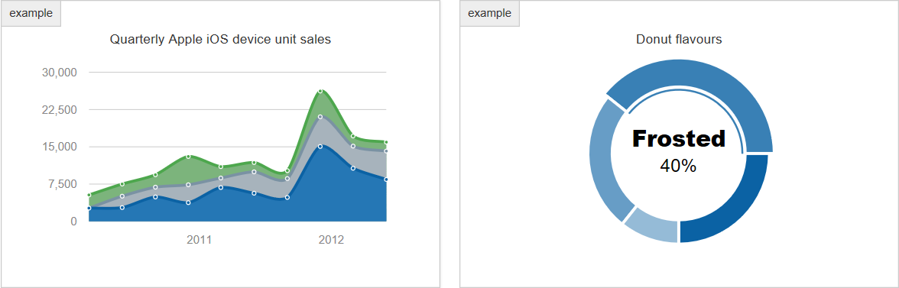

Morris Chart.js PDO-PHP and MySQL
=================================

This demonstrates with source code the way in which to easily populate Morris
Charts dynamically with PDO-PHP using Json with little markup. Code includes
examples for a Bar chart, Line chart, Area chart and a Donut chart.

Two methods are found in the source code.

-   A Static method connecting directly using only Json data.

-   A dynamic MySQL data connection from the Database with php using a PDO
    Connection. This provides a simple solution of extracting data from the
    server and efficiently populating the JavaScript / JQuery graph in the
    browser using Json.

Getting Started
---------------

Download the file folder and extract the files. Run the index.php file in a
XAMPP or WAMP stack. Full Source Code is provided and includes Bootstrap 3
versioned files.

JSON JavaScript Object Notation, is syntax for storing and exchanging data. And
is written in JavaScript Object Notation and is a lightweight data
–interchanging format.

Morris requires the data in Json Text (string) format and does not need to parse
it into a JavaScript Object using var JavaScript Object =
JSON.parse(myJSONtext);

I noticed that many PDO-PHP to Morris solutions wrapped the Morris JavaScript
into a foreach statement to process the information creating HUGE OVERHEAD.

The only good solution is to convert the data into Json at the server level
(php). Echo the Json string as a variable into the Morris’s JavaScript making it
an efficient transfer of server /client data information with a quick graph
uptime in the client browser.

The trick is to create the correct Aliases in the SQL statement when calling the
Database. The result is a quick and easy way to parse the results into the
required Json format to be sent to the Morris Chart.

Let work with the Donut Chart which requires the *label* and *value* for each
input. We change the sql statement to reflect the ‘ip as *label*’ and ‘count(\*)
as *value*’. This will allow us to prepare and execute the PDO statement. PDO
performs all the magic in FETCH\_ASSOC using fetchAll.

**\<?php**

**\$sql ="SELECT ip as label, count(\*) as value from totalview GROUP by label
ORDER BY value DESC LIMIT 5";**

**\$stmt = \$PDO-\>prepare(\$sql);**

**\$stmt -\>execute();**

**\$data=\$stmt-\>fetchAll(PDO::FETCH\_ASSOC);**

**\$phpobj =json\_encode(\$data);**

**?\>**

Once the data has been fetched we use the standard json\_encode function. To
transfer the data from the server to the browser and populate the donut chart ,
a JavaScript function is created.

**\<script language="JavaScript" type="text/javascript"\>**

**\$(function() {**

// Send the PHP Json\_encoded data to a JavaScript Variable.

**var jsobj = \<?php echo \$phpobj; ?\>;**

// Donut Chart

**Morris.Donut({**

**element: 'morris-donut-chart',**

// populate the Morris Donut chart with the Json Data.

**data:jsobj,**

**resize: true**

**});**

**});**

**\</script\>**

Pulling the data from the Database requires low overhead. The conversion to Json
is quick and easy and sending light- weight data from the Server does not slow
the response in the browser.

### Prerequisites

`This project uses MorrisChart.js. The full download can be obtained from
`[Github Here](http://morrisjs.github.io/morris.js/)`. The code uses `[PHP 5.6
and higher](http://php.net/downloads.php)`.`

Author
------

**Greg Bayes** - [Bayesean Blog](https://www.bayeseanblog.com/).

https://www.bayeseanblog.com.

License
-------

This project is licensed under the MIT license agreement.

Permission is hereby granted, free of charge, to any person obtaining a copy of
this software and associated documentation files (the "Software"), to deal in
the Software without restriction, including without limitation the rights to
use, copy, modify, merge, publish, distribute, sublicense, and/or sell copies of
the Software, and to permit persons to whom the Software is furnished to do so,
subject to the following conditions: The above copyright notice and this
permission notice shall be included in all copies or substantial portions of the
Software.

THE SOFTWARE IS PROVIDED "AS IS", WITHOUT WARRANTY OF ANY KIND, EXPRESS OR
IMPLIED, INCLUDING BUT NOT LIMITED TO THE WARRANTIES OF MERCHANTABILITY, FITNESS
FOR A PARTICULAR PURPOSE AND NONINFRINGEMENT. IN NO EVENT SHALL THE AUTHORS OR
COPYRIGHT HOLDERS BE LIABLE FOR ANY CLAIM, DAMAGES OR OTHER LIABILITY, WHETHER
IN AN ACTION OF CONTRACT, TORT OR OTHERWISE, ARISING FROM, OUT OF OR IN
CONNECTION WITH THE SOFTWARE OR THE USE OR OTHER DEALINGS IN THE SOFTWARE.

Acknowledgments
---------------

Thank you to Morris Charts for their great work. It is hoped that they will
continue with refinement and future updates.
